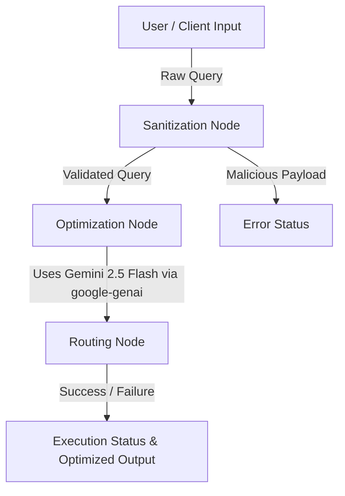

# Architecture & Codebase Explanation

This document provides a comprehensive overview of the **Enterprise Database & Query Optimization Agent System** built using the Google ADK 2.0 framework. It explains the core architecture, the purpose of each file, and how the system components interact to provide secure, optimized database query execution.

---

## 1. System Architecture Overview

The system is designed as a **Directed Acyclic Graph (DAG)** orchestrated by `langgraph`. It operates as a state machine where a database query flows through distinct, isolated nodes.



### Core Components
1. **The State Machine (`DatabaseSessionState`)**: A TypedDict container that tracks the query's journey, maintaining a history of modifications, session logs, and any errors encountered.
2. **The Graph Workflow (`agent.py`)**: The central routing logic that passes the state through the sanitization, optimization, and routing nodes.
3. **The Custom Tool Server (`mcp_server.py`)**: A Model Context Protocol (MCP) server that provides strict, rigorously typed tools to the agent, allowing it to safely fetch database schemas and query execution plans without direct database credential exposure.

---

## 2. Directory & File Structure (What is Where)

```text
db-query-opt-agent/
├── app/
│   ├── agent.py               # 🧠 Core ADK Graph & LLM logic
│   ├── mcp_server.py          # 🛠️ Custom MCP Tool Server
│   ├── config.py              # ⚙️ Application configuration (Auto-generated)
│   ├── fast_api_app.py        # 🌐 FastAPI runner for deployment (Auto-generated)
│   └── app_utils/             # 🧰 Helpers and utilities (Auto-generated)
├── tests/
│   └── unit/
│       └── test_agent.py      # 🧪 Pytest definitions for graph execution
├── pyproject.toml             # 📦 Python dependencies (uv sync)
├── api.env                    # 🔑 Secure environment variables (in the parent directory)
└── README.md                  # 📖 Setup, usage, and local testing instructions
```

---

## 3. Detailed File Breakdown

### A. `app/agent.py`
This is the **brain** of the agent system. It defines the ADK 2.0 graph workflow.
- **`DatabaseSessionState`**: The dictionary that holds all context during a single run.
- **`sanitize_input_node`**: Acts as a security firewall. It uses Python's `re` (regex) library to scan the incoming `raw_query` for destructive commands like `DROP` or `DELETE`, and rejects multi-statement payloads separated by semicolons.
- **`optimize_query_node`**: The core AI node. It uses the `google-genai` SDK to call the **Gemini 2.5 Flash** model. It injects the sanitized query into an expert optimization prompt, asking the LLM to rewrite the query for maximum efficiency.
- **`routing_node`**: The final evaluator. It checks if the `execution_status` was flagged as `FAILED` during sanitization or optimization. If not, it marks the run as `SUCCESS`.

### B. `app/mcp_server.py`
This script defines the **Model Context Protocol (MCP)** tool server using the official `mcp` SDK.
- It exposes two enterprise-grade tools to the graph:
  1. `fetch_database_schema`: Retrieves mocked schema definitions for database tables.
  2. `explain_query_plan`: Returns a mocked `EXPLAIN ANALYZE` output for the given query.
- **Pydantic Validation**: It uses Pydantic schemas (`FetchDatabaseSchemaArgs`, `ExplainQueryPlanArgs`) to rigorously validate tool inputs. For example, the `validate_table_name` validator ensures table names contain only alphanumeric characters to prevent injection attacks natively at the tool boundary.

### C. `tests/unit/test_agent.py`
This file contains **production-grade unit tests** written in `pytest`.
- **`test_clean_query_optimization`**: Simulates a valid `SELECT` query, ensuring it successfully passes sanitization and reaches the optimization node.
- **`test_malicious_injection_payload`**: Simulates a `DROP TABLE` injection attempt, validating that the graph immediately flags it and updates the `execution_status` to `SANITIZATION_FAILED` with appropriate error logs.

### D. `pyproject.toml`
The configuration file used by the Astral `uv` package manager to lock and install project dependencies. Key packages include:
- `langgraph`: For orchestrating the node-based graph.
- `google-genai`: The official Gemini SDK used for the LLM optimization logic.
- `mcp`: The protocol SDK enabling secure tool server communication.
- `pydantic`: For rigorous input validation.

### E. `api.env` (Located in Capstone Root)
The file defining the environment variables. The system specifically parses `GEMINI_API_KEY` from this file to ensure that credentials are not hardcoded in the application repository.

---

## 4. How the Flow Operates

1. **Initialization**: A user submits a query through the `agents-cli playground` or programmatic invocation.
2. **Context Creation**: The system initializes the `DatabaseSessionState` with the `raw_query`.
3. **Sanitization**: The state moves to `sanitize_input_node`. If malicious intent is detected, the run aborts early, logging the errors.
4. **Optimization**: If clean, the state passes to `optimize_query_node`. The Gemini model analyzes the SQL and generates a highly optimized rewrite.
5. **Finalization**: `routing_node` assesses the output and returns the final state to the user, complete with detailed execution logs and the modified SQL string.
